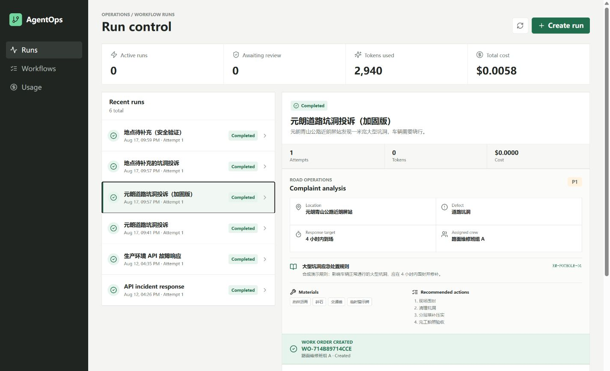
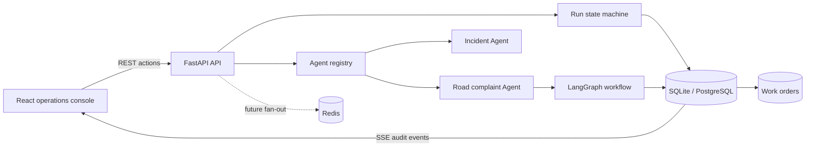

# AgentOps Studio

[English](README.md) | [简体中文](README.zh-CN.md)

[](https://github.com/ziggy-xzding/agentops-studio/actions/workflows/ci.yml)
[](backend/pyproject.toml)
[](frontend/package.json)
[](LICENSE)

AgentOps Studio is a full-stack operations console for observable, human-in-the-loop Agent workflows. It demonstrates how to register domain Agents, execute LangGraph workflows, pause for review, persist audit history, handle failures, and create durable work orders from approved outputs.

The project is designed for reproducible local evaluation. It runs without an LLM API key, uses synthetic rules and prompts, and clearly distinguishes reusable engineering patterns from deliberate demo constraints.



## Contents

- [Highlights](#highlights)
- [Included Agents](#included-agents)
- [Tech Stack](#tech-stack)
- [Architecture](#architecture)
- [Quick Start](#quick-start)
- [Demo Workflows](#demo-workflows)
- [API](#api)
- [Verification](#verification)
- [Current Limitations](#current-limitations)
- [Roadmap](#roadmap)
- [Security And Privacy](#security-and-privacy)
- [License](#license)

## Highlights

- Pluggable Agent registry with a shared adapter contract
- LangGraph workflows behind a domain-enforced run state machine
- Human approval and rejection with review notes
- Deterministic road complaint triage with negation handling and clarification gates
- Persistent, uniquely identified work orders created in the approval transaction
- Failure injection, retry attempts, usage totals, and immutable audit events
- FastAPI REST API and Server-Sent Events
- Responsive React operations console for desktop and mobile
- SQLite for zero-config development; PostgreSQL and Redis in Docker Compose
- Automated backend, frontend, build, and Compose checks in GitHub Actions

## Included Agents

| Agent                     | Purpose                                                                                           | Execution model                                                    |
| ------------------------- | ------------------------------------------------------------------------------------------------- | ------------------------------------------------------------------ |
| Incident response planner | Produces a deterministic incident response plan for human review                                  | Synthetic usage values demonstrate observability and retry UI      |
| Road complaint triage     | Extracts road defects, applies synthetic rules, checks dispatch safety, and proposes a work order | Deterministic rules; reports zero model tokens and zero model cost |

## Tech Stack

| Layer               | Technology                                               |
| ------------------- | -------------------------------------------------------- |
| Frontend            | React 18, TypeScript, Vite, TanStack Query, Lucide       |
| API                 | FastAPI, Pydantic                                        |
| Agent orchestration | LangGraph                                                |
| Persistence         | SQLAlchemy, SQLite, PostgreSQL                           |
| Event delivery      | Server-Sent Events; Redis provisioned for future fan-out |
| Testing             | pytest, Vitest, Testing Library, Ruff                    |
| Deployment          | Docker Compose, Nginx, GitHub Actions                    |

## Architecture



The database is the source of truth for runs, tasks, review decisions, work orders, and audit history. See [Architecture](docs/architecture.md) for component boundaries, workflow sequences, the data model, and extension points.

## Quick Start

### Prerequisites

- Python 3.11 or newer; Python 3.12 is used in CI and Docker
- Node.js 20 or newer; Node.js 22 is used in CI and Docker
- pnpm 10.15.1

### 1. Start the backend

Windows PowerShell:

```powershell
cd backend
py -3.12 -m venv .venv
.\.venv\Scripts\python.exe -m pip install -e ".[dev]"
.\.venv\Scripts\python.exe -m uvicorn app.main:app --reload
```

macOS or Linux:

```bash
cd backend
python3 -m venv .venv
./.venv/bin/python -m pip install -e '.[dev]'
./.venv/bin/python -m uvicorn app.main:app --reload
```

The backend defaults to `sqlite:///./agentops.db`; no `.env` file is required.

### 2. Start the frontend

In another terminal:

```bash
cd frontend
pnpm install --frozen-lockfile
pnpm dev
```

Open [http://localhost:5173](http://localhost:5173). Interactive API documentation is available at [http://localhost:8000/docs](http://localhost:8000/docs).

### Optional environment overrides

The application works with local defaults. To customize them, copy `.env.example` to `backend/.env` for direct backend execution, or to `.env` in the repository root for Docker Compose. Real `.env` files are ignored by Git.

## Docker Compose

```bash
docker compose up --build
```

Open [http://localhost:3000](http://localhost:3000). Compose starts Nginx, FastAPI, PostgreSQL, and Redis with health checks. Built-in database credentials are local-development defaults only; override them through `.env` outside a local machine.

Stop the stack with:

```bash
docker compose down
```

Add `-v` only when you intentionally want to remove the local PostgreSQL volume.

## Demo Workflows

### Valid road complaint

1. Select **Create run** and choose **Road complaint triage**.
2. Enter `元朗青山公路近朗屏站发现一米宽大型坑洞，车辆需要绕行。`
3. Run the workflow and inspect location, defect, priority `P1`, rule `RM-POTHOLE-01`, response target, crew, materials, and actions.
4. Add a review note and approve the plan.
5. Confirm that a unique `WO-...` record appears with status `created` in the UI, API, and audit history.

`created` means the work order was persisted locally. It does not claim that an external crew management system accepted the job.

### Missing-location safety path

1. Enter `九龙某道路有一米宽大型坑洞，车辆需要绕行。`
2. Run the workflow.
3. Confirm that the Agent marks the crew as unassigned and requests a precise location.
4. Approve the clarification request.
5. Confirm that the workflow records `clarification_requested` and creates no work order.

### Retry path

1. Create an incident response run.
2. Select **Simulate failure**.
3. Inspect the failed task and audit event.
4. Select **Retry run** and confirm a new attempt reaches human review.

## API

| Method | Endpoint                 | Purpose                                |
| ------ | ------------------------ | -------------------------------------- |
| `GET`  | `/api/health`            | Service health check                   |
| `GET`  | `/api/agents`            | List registered Agents                 |
| `POST` | `/api/runs`              | Create a draft run                     |
| `GET`  | `/api/runs`              | List runs with tasks and audit history |
| `GET`  | `/api/runs/{id}`         | Read one run                           |
| `POST` | `/api/runs/{id}/execute` | Execute to the human review gate       |
| `POST` | `/api/runs/{id}/approve` | Approve the current review outcome     |
| `POST` | `/api/runs/{id}/reject`  | Reject with a review note              |
| `POST` | `/api/runs/{id}/retry`   | Retry a failed run                     |
| `GET`  | `/api/runs/{id}/events`  | Stream committed audit events via SSE  |
| `GET`  | `/api/work-orders`       | List persisted work orders             |
| `GET`  | `/api/work-orders/{id}`  | Read one work order                    |

## Verification

Backend:

```bash
cd backend
./.venv/bin/ruff check app tests
./.venv/bin/python -m pytest
```

On Windows, use `.venv\Scripts\ruff.exe` and `.venv\Scripts\python.exe`.

Frontend:

```bash
cd frontend
pnpm install --frozen-lockfile
pnpm test
pnpm build
```

Repository configuration:

```bash
docker compose config --quiet
```

## Repository Layout

```text
agentops-studio/
|-- backend/                 FastAPI, LangGraph, domain services, persistence, tests
|-- frontend/                React operations console and component tests
|-- docs/                    Architecture notes and implementation plans
|-- .github/                 CI workflow and collaboration templates
|-- .env.example             Safe local configuration example
|-- docker-compose.yml       PostgreSQL, Redis, backend, and frontend stack
|-- CONTRIBUTING.md          Contribution workflow and quality requirements
|-- SECURITY.md              Vulnerability reporting and data-safety policy
`-- LICENSE                  MIT license
```

## Design Decisions

- **Registry boundary:** Domain Agents implement one adapter contract; the generic run lifecycle does not depend on complaint-specific code.
- **Deterministic first:** Reviewers can reproduce the demo without credentials or variable model output.
- **Safe dispatch:** Negated terms and missing locations cannot create a work order.
- **Server-owned demo actor:** The API records `local-demo-reviewer` instead of trusting a client-supplied identity.
- **Atomic work-order creation:** Approval, task output, work order, and audit event are committed together.
- **Durable audit before live delivery:** SSE replays committed database events on connection.

## Current Limitations

- Authentication, workspaces, and role-based access control are not implemented.
- The reviewer identity is a server-owned local demo value, not an authenticated user.
- Execution is synchronous; there are no background workers or cancellation controls.
- LangGraph checkpoints do not yet resume execution across the human review gate.
- Redis is provisioned but not wired to cross-process SSE fan-out.
- Complaint parsing is a small synthetic ruleset, not a production classifier or geocoder.
- Work-order status is locally persisted; there is no external dispatch-system integration.

## Roadmap

1. Add JWT authentication, workspaces, and reviewer roles.
2. Add background workers, cancellation, and exponential retry policies.
3. Add model-provider adapters, prompt/version tracking, and callback-based usage accounting.
4. Persist LangGraph checkpoints for interrupt and resume.
5. Add Redis fan-out, OpenTelemetry traces, Prometheus metrics, and evaluation datasets.

## Security And Privacy

All prompts, complaint rules, locations, and outputs in this repository are synthetic demonstrations. Do not add credentials, employer source code, internal documents, real customer or citizen data, or proprietary evaluation sets.

See [SECURITY.md](SECURITY.md) for vulnerability reporting and repository data-safety rules.

## Contributing

See [CONTRIBUTING.md](CONTRIBUTING.md). Changes should remain focused, include tests proportional to risk, and preserve the synthetic-data boundary.

## License

Released under the [MIT License](LICENSE).
