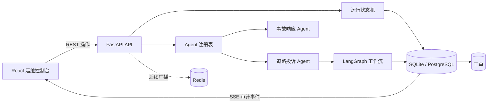

# AgentOps Studio

[English](README.md) | [简体中文](README.zh-CN.md)

[](https://github.com/ziggy-xzding/agentops-studio/actions/workflows/ci.yml)
[](backend/pyproject.toml)
[](frontend/package.json)
[](LICENSE)

AgentOps Studio 是一个面向“可观测、有人审”的 Agent 工作流全栈运维平台。项目演示了如何注册领域 Agent、运行 LangGraph 工作流、暂停等待审核、持久化审计历史、处理失败重试，并把审核通过的结果转化为可查询的工单。

项目支持可复现的本地评估：无需大模型 API Key 即可运行，全部规则与输入均为合成数据，并明确区分可复用的工程模式与演示版本的限制。


## 目录

- [项目亮点](#项目亮点)
- [内置 Agent](#内置-agent)
- [技术栈](#技术栈)
- [系统架构](#系统架构)
- [快速开始](#快速开始)
- [演示流程](#演示流程)
- [API](#api)
- [验证命令](#验证命令)
- [当前限制](#当前限制)
- [路线图](#路线图)
- [安全与隐私](#安全与隐私)
- [许可证](#许可证)

## 项目亮点

- 基于统一适配器协议的可插拔 Agent 注册表
- LangGraph 工作流与领域状态机分层
- 带审核意见的人工批准和拒绝流程
- 支持否定语义与信息补充门控的道路投诉分类
- 审批事务内创建、具有唯一编号的持久化工单
- 失败注入、重试次数、用量汇总和不可变审计事件
- FastAPI REST API 与 Server-Sent Events
- 适配桌面端和移动端的 React 运维界面
- 本地零配置 SQLite，以及 Docker Compose 中的 PostgreSQL、Redis
- GitHub Actions 自动执行后端、前端、构建与 Compose 检查

## 内置 Agent

| Agent              | 用途                                                   | 执行方式                                |
| ------------------ | ------------------------------------------------------ | --------------------------------------- |
| 事故响应规划 Agent | 生成确定性的事故响应方案并等待人工审核                 | 使用合成用量数据展示监控和重试界面      |
| 道路投诉分类 Agent | 提取道路缺陷、应用合成规则、检查派工条件并提出工单草案 | 确定性规则，模型 Token 和模型成本均为零 |

## 技术栈

| 层级       | 技术                                               |
| ---------- | -------------------------------------------------- |
| 前端       | React 18、TypeScript、Vite、TanStack Query、Lucide |
| API        | FastAPI、Pydantic                                  |
| Agent 编排 | LangGraph                                          |
| 持久化     | SQLAlchemy、SQLite、PostgreSQL                     |
| 事件传递   | Server-Sent Events；Redis 为后续跨进程广播预留     |
| 测试       | pytest、Vitest、Testing Library、Ruff              |
| 部署       | Docker Compose、Nginx、GitHub Actions              |

## 系统架构



数据库是运行记录、任务、审核决定、工单和审计历史的事实来源。详细组件边界、工作流时序、数据模型和扩展方式见[中文架构文档](docs/architecture.zh-CN.md)。

## 快速开始

### 环境要求

- Python 3.11 或更高版本；CI 和 Docker 使用 Python 3.12
- Node.js 20 或更高版本；CI 和 Docker 使用 Node.js 22
- pnpm 10.15.1

### 1. 启动后端

Windows PowerShell：

```powershell
cd backend
py -3.12 -m venv .venv
.\.venv\Scripts\python.exe -m pip install -e ".[dev]"
.\.venv\Scripts\python.exe -m uvicorn app.main:app --reload
```

macOS 或 Linux：

```bash
cd backend
python3 -m venv .venv
./.venv/bin/python -m pip install -e '.[dev]'
./.venv/bin/python -m uvicorn app.main:app --reload
```

后端默认使用 `sqlite:///./agentops.db`，无需创建 `.env`。

### 2. 启动前端

打开另一个终端：

```bash
cd frontend
pnpm install --frozen-lockfile
pnpm dev
```

访问 [http://localhost:5173](http://localhost:5173)，交互式 API 文档位于 [http://localhost:8000/docs](http://localhost:8000/docs)。

### 可选环境配置

项目可以直接使用本地默认值。如需调整，直接运行后端时可将 `.env.example` 复制为 `backend/.env`；使用 Docker Compose 时可复制为仓库根目录的 `.env`。所有真实 `.env` 文件都会被 Git 忽略。

## Docker Compose

```bash
docker compose up --build
```

访问 [http://localhost:3000](http://localhost:3000)。Compose 会启动 Nginx、FastAPI、PostgreSQL 和 Redis，并配置健康检查。内置数据库凭据仅用于本地开发；非本地环境必须通过 `.env` 覆盖。

停止服务：

```bash
docker compose down
```

只有明确需要删除本地 PostgreSQL 数据卷时才添加 `-v`。

## 演示流程

### 信息完整的道路投诉

1. 点击 **Create run**，选择 **Road complaint triage**。
2. 输入：`元朗青山公路近朗屏站发现一米宽大型坑洞，车辆需要绕行。`
3. 运行后检查地点、缺陷、优先级 `P1`、规则 `RM-POTHOLE-01`、响应时限、班组、材料和操作步骤。
4. 填写审核意见并批准。
5. 确认界面、API 和审计历史中出现唯一的 `WO-...` 工单，状态为 `created`。

`created` 只表示工单已经在本地数据库落地，不代表外部班组系统已经接单。

### 地点不完整的安全路径

1. 输入：`九龙某道路有一米宽大型坑洞，车辆需要绕行。`
2. 运行工作流。
3. 确认 Agent 将班组标记为“待分配”，并要求补充准确地点。
4. 批准补充信息请求。
5. 确认系统记录 `clarification_requested`，且不创建工单。

### 失败重试路径

1. 创建事故响应任务。
2. 点击 **Simulate failure**。
3. 查看失败任务和审计事件。
4. 点击 **Retry run**，确认新的尝试进入人工审核。

## API

| 方法   | 接口                     | 用途                          |
| ------ | ------------------------ | ----------------------------- |
| `GET`  | `/api/health`            | 服务健康检查                  |
| `GET`  | `/api/agents`            | 获取已注册 Agent              |
| `POST` | `/api/runs`              | 创建草稿任务                  |
| `GET`  | `/api/runs`              | 获取任务、步骤和审计历史      |
| `GET`  | `/api/runs/{id}`         | 获取单个任务                  |
| `POST` | `/api/runs/{id}/execute` | 执行到人工审核节点            |
| `POST` | `/api/runs/{id}/approve` | 批准当前审核结果              |
| `POST` | `/api/runs/{id}/reject`  | 填写原因并拒绝                |
| `POST` | `/api/runs/{id}/retry`   | 重试失败任务                  |
| `GET`  | `/api/runs/{id}/events`  | 通过 SSE 获取已提交的审计事件 |
| `GET`  | `/api/work-orders`       | 获取持久化工单列表            |
| `GET`  | `/api/work-orders/{id}`  | 获取单个工单                  |

## 验证命令

后端：

```bash
cd backend
./.venv/bin/ruff check app tests
./.venv/bin/python -m pytest
```

Windows 使用 `.venv\Scripts\ruff.exe` 和 `.venv\Scripts\python.exe`。

前端：

```bash
cd frontend
pnpm install --frozen-lockfile
pnpm test
pnpm build
```

仓库配置：

```bash
docker compose config --quiet
```

## 仓库结构

```text
agentops-studio/
|-- backend/                 FastAPI、LangGraph、领域服务、持久化与测试
|-- frontend/                React 运维控制台与组件测试
|-- docs/                    架构文档与实施计划
|-- .github/                 CI 工作流与协作模板
|-- .env.example             安全的本地配置示例
|-- docker-compose.yml       PostgreSQL、Redis、后端与前端编排
|-- CONTRIBUTING.md          贡献流程和质量要求
|-- SECURITY.md              漏洞报告与数据安全规则
`-- LICENSE                  MIT 许可证
```

## 关键设计决定

- **注册表边界：**领域 Agent 实现统一适配器协议，通用运行生命周期不依赖投诉业务代码。
- **确定性优先：**评审者无需凭据即可稳定复现演示。
- **安全派工：**否定描述和缺少地点的输入不能创建工单。
- **服务端演示身份：**API 记录 `local-demo-reviewer`，不信任客户端提交的身份。
- **工单原子落地：**审批、任务输出、工单和审计事件在同一事务中提交。
- **先持久化再推送：**SSE 连接会重放数据库中已提交的审计事件。

## 当前限制

- 尚未实现登录、工作空间和基于角色的访问控制。
- 审批人是服务端提供的本地演示值，不是真实登录用户。
- 执行是同步的，没有后台 Worker 和取消控制。
- LangGraph 尚未通过 checkpoint 跨人工审核节点恢复运行。
- Redis 已部署，但尚未接入跨进程 SSE 广播。
- 投诉解析是小型合成规则集，不是生产级分类器或地理编码服务。
- 工单状态只在本地持久化，尚未对接外部派工系统。

## 路线图

1. 增加 JWT 登录、工作空间和审核角色。
2. 增加后台 Worker、取消机制和指数退避重试。
3. 增加模型供应商适配器、Prompt 版本和真实用量回调。
4. 使用 LangGraph checkpoint 实现中断与恢复。
5. 增加 Redis 广播、OpenTelemetry、Prometheus 和评测数据集。

## 安全与隐私

仓库中的 Prompt、投诉规则、地点和输出全部为合成演示数据。请勿加入凭据、雇主源码、内部文档、真实客户或市民数据，以及专有评测集。

漏洞报告和仓库数据安全规则见 [SECURITY.md](SECURITY.md)。

## 参与贡献

请阅读 [CONTRIBUTING.md](CONTRIBUTING.md)。变更应保持聚焦、根据风险补充测试，并持续遵守合成数据边界。

## 许可证

项目使用 [MIT License](LICENSE)。
