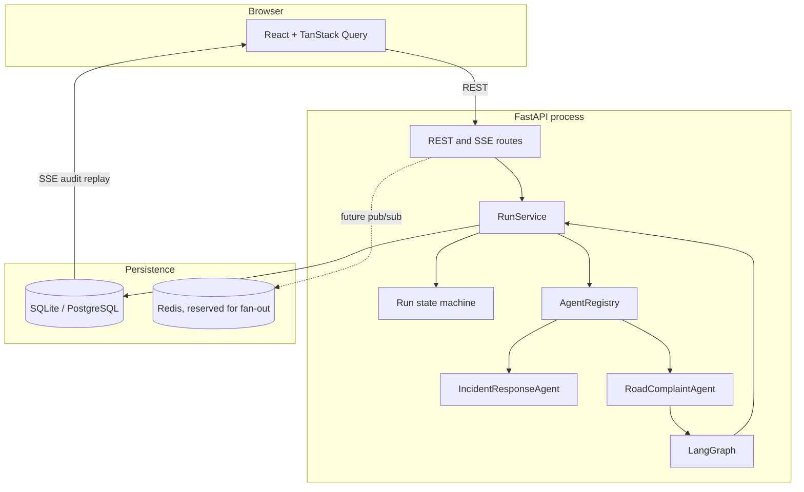
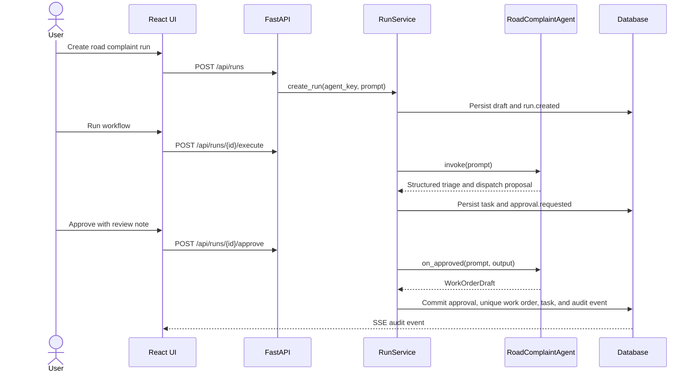
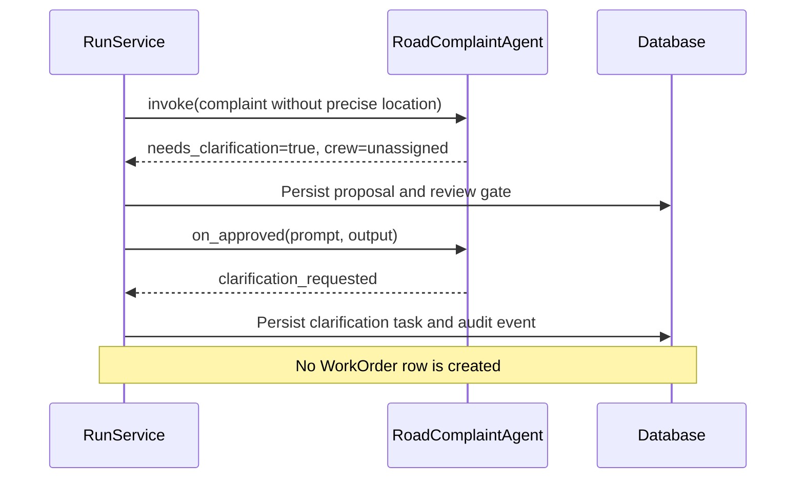
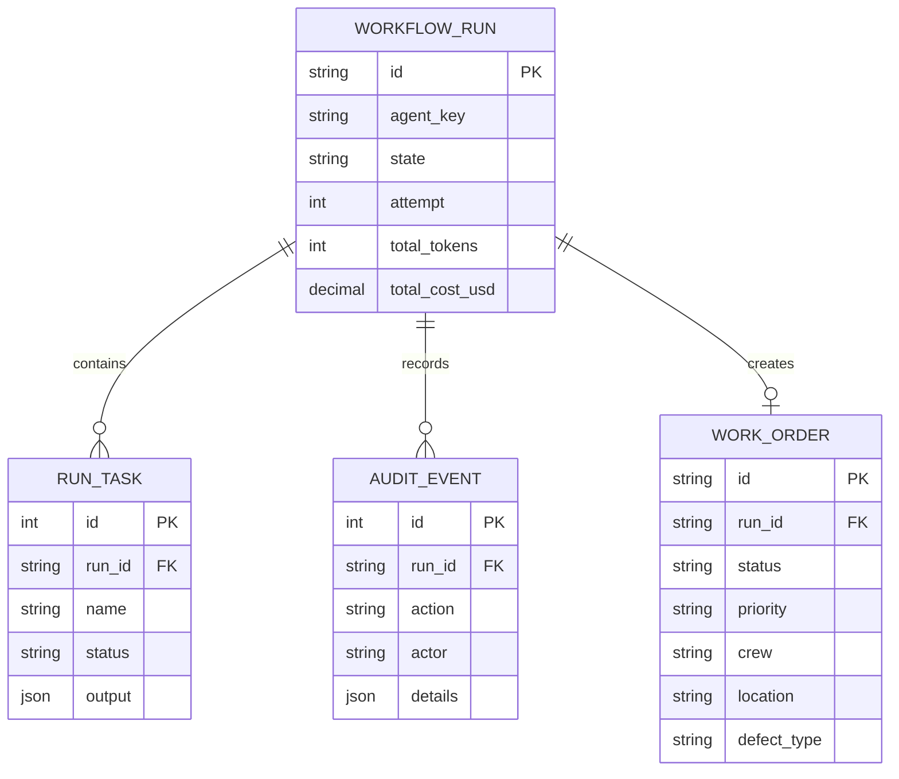
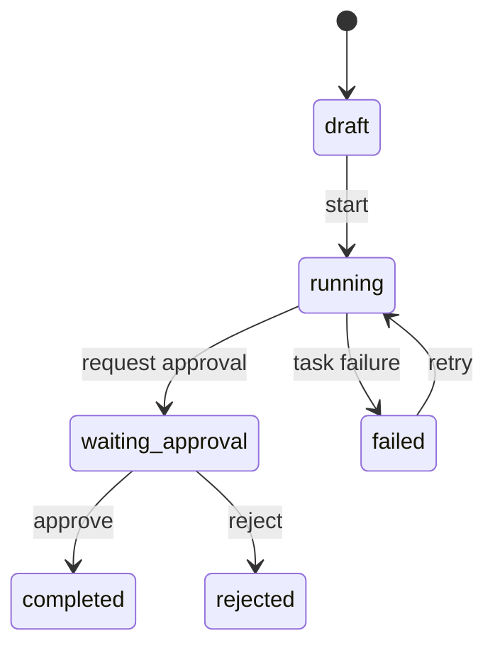

# AgentOps Studio Architecture

[English](architecture.md) | [简体中文](architecture.zh-CN.md)

## Goals

AgentOps Studio separates reusable workflow operations from domain-specific Agent logic. The operations layer owns lifecycle transitions, persistence, review decisions, retries, usage totals, and audit history. Each domain Agent owns prompt interpretation and the output proposed for human review.

The current implementation favors reproducibility and explicit boundaries over production-scale infrastructure.

## Component View

## Backend Boundaries

| Module | Responsibility |
|---|---|
| `app/api` | HTTP validation, response schemas, SSE transport, typed errors |
| `app/domain` | Legal workflow state transitions independent of HTTP or SQLAlchemy |
| `app/services` | Use-case orchestration and transaction boundaries |
| `app/agents` | Agent contract, registry, domain workflows, approval follow-ups |
| `app/models.py` | SQLAlchemy persistence models |
| `app/schemas.py` | Pydantic API contracts |
| `app/db.py` | Engine/session setup and zero-config startup initialization |

## Agent Contract

Each registered Agent exposes metadata, `invoke(prompt)`, and an optional `on_approved(prompt, output)` follow-up. `RunService` resolves the selected Agent by the immutable `agent_key` stored on the run.

`AgentResult` contains the task name, structured output, token count, and cost. `ApprovalResult` can contain a follow-up task and an optional typed `WorkOrderDraft`. The service, not the Agent, assigns the durable work-order identifier.

This boundary lets new Agents reuse lifecycle, review, retry, persistence, SSE, and UI infrastructure.

## Valid Complaint Sequence

## Clarification Sequence

## Data Model

## Run State Machine

Invalid transitions fail in the domain layer even if a caller bypasses UI controls.

## Consistency And Audit

- The SQL database is the durable source of truth.
- Work-order creation and its approval task/audit event share one transaction.
- Review notes are stored on the approval task and audit event.
- The demo actor is owned by the API boundary, so clients cannot choose the audit identity.
- SSE streams committed audit rows and can replay history after reconnecting.

## Local And Container Deployment

Local development uses SQLite and requires no environment file. Docker Compose uses PostgreSQL and provisions Redis. Nginx serves the production frontend build and proxies `/api` to FastAPI.

Redis is not part of the active consistency path yet. It is reserved for cross-process fan-out when background workers and multiple API replicas are introduced.

## Extension Points

1. Add a new Agent adapter and register it in `get_default_registry()`.
2. Add provider callbacks to replace deterministic or synthetic usage values.
3. Add authenticated identity at the API boundary without changing service audit calls.
4. Add LangGraph checkpoint storage and explicit interrupt/resume semantics.
5. Move synchronous execution to workers while preserving the run state machine.
6. Publish committed audit events through Redis for multiple API replicas.

## Production Gaps

The current system intentionally omits authentication/RBAC, background workers, cancellation, checkpoint resume, cross-process event fan-out, production natural-language classification, geocoding, and external dispatch integration. These are documented constraints, not implied capabilities.
