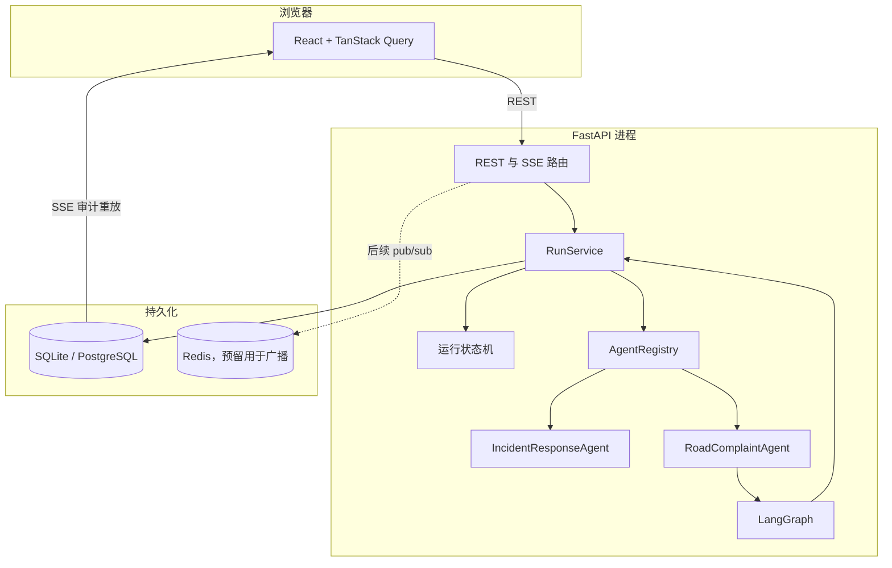
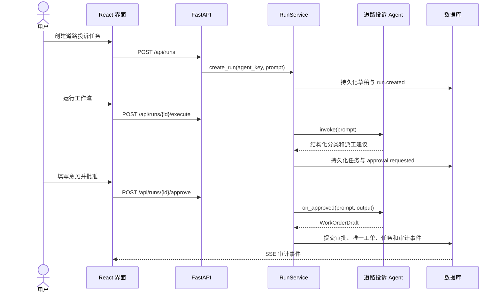
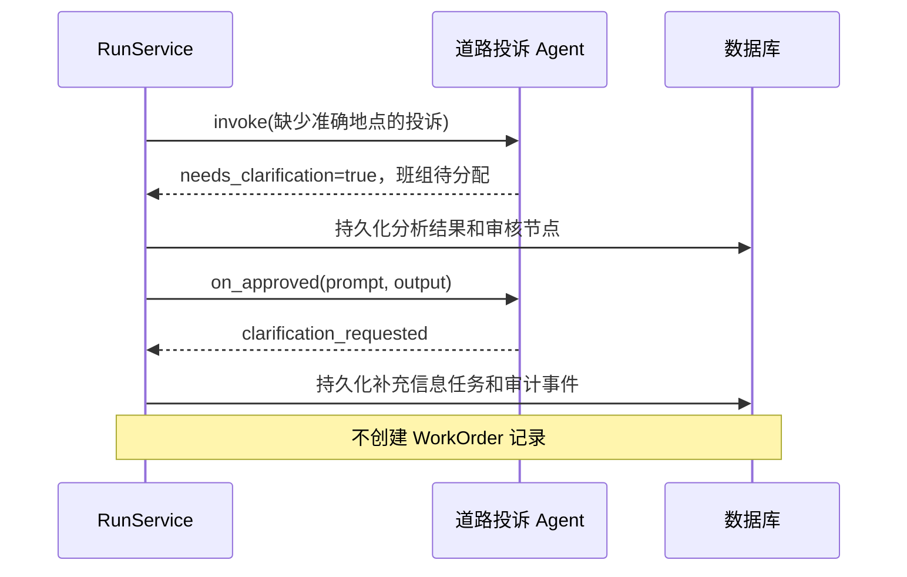
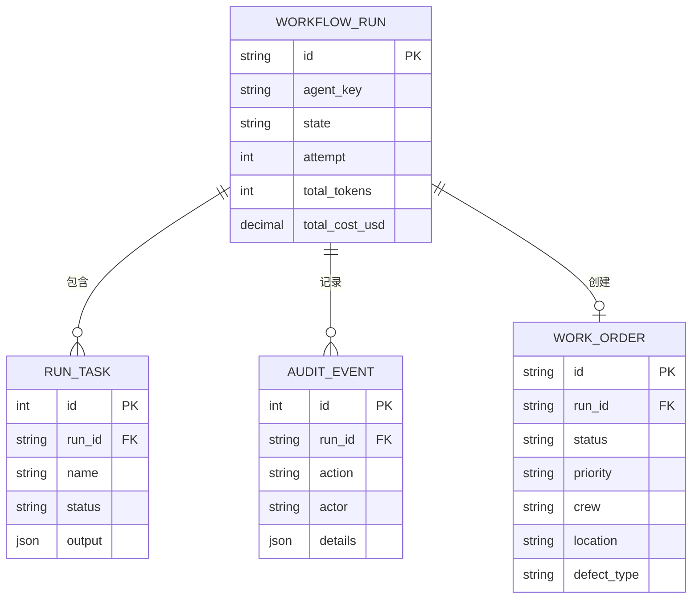
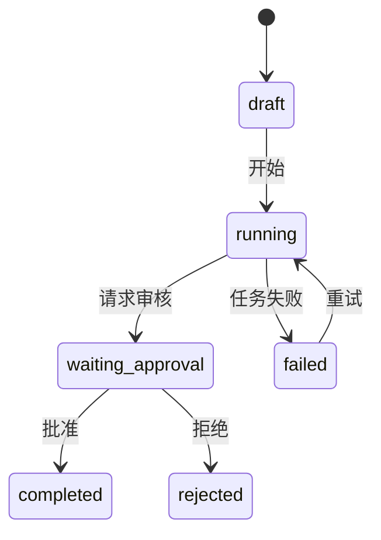

# AgentOps Studio 架构说明

[English](architecture.md) | [简体中文](architecture.zh-CN.md)

## 设计目标

AgentOps Studio 将通用工作流运维能力与领域 Agent 逻辑分离。运维层负责生命周期、持久化、人工审核、失败重试、用量统计和审计历史；每个领域 Agent 负责理解输入并产生等待人工确认的结构化结果。

当前实现优先保证可复现性和清晰边界，而不是伪装成已经具备生产规模的基础设施。

## 组件视图

## 后端模块边界

| 模块 | 职责 |
|---|---|
| `app/api` | HTTP 校验、响应模型、SSE 传输和结构化错误 |
| `app/domain` | 与 HTTP、SQLAlchemy 无关的合法状态流转 |
| `app/services` | 用例编排和事务边界 |
| `app/agents` | Agent 协议、注册表、领域工作流和审批后续动作 |
| `app/models.py` | SQLAlchemy 持久化模型 |
| `app/schemas.py` | Pydantic API 契约 |
| `app/db.py` | 数据库引擎、Session 和零配置启动初始化 |

## Agent 协议

每个注册 Agent 暴露元数据、`invoke(prompt)` 和可选的 `on_approved(prompt, output)`。`RunService` 根据运行记录中不可变的 `agent_key` 解析 Agent。

`AgentResult` 包含任务名称、结构化输出、Token 和成本；`ApprovalResult` 可以包含后续任务以及类型化的 `WorkOrderDraft`。持久化工单编号由服务层生成，而不是由 Agent 伪造。

因此新增 Agent 可以直接复用状态流转、审核、重试、持久化、SSE 和前端基础设施。

## 有效投诉时序

## 补充信息时序

## 数据模型

## 运行状态机

即使调用方绕过前端按钮，非法状态流转仍会在领域层失败。

## 一致性与审计

- SQL 数据库是持久化事实来源。
- 工单、审批任务和审计事件在同一事务中创建。
- 审核意见同时保存在审批任务和审计事件中。
- 演示审批身份由 API 边界提供，客户端不能自行指定审计身份。
- SSE 只传递已提交的审计记录，并支持连接后重放历史。

## 本地与容器部署

本地开发使用 SQLite，无需环境文件。Docker Compose 使用 PostgreSQL 并部署 Redis；Nginx 托管前端生产构建，并将 `/api` 代理到 FastAPI。

Redis 当前不参与一致性路径。引入后台 Worker 和多个 API 副本后，可用于跨进程事件广播。

## 扩展点

1. 实现新的 Agent 适配器并注册到 `get_default_registry()`。
2. 添加模型回调，替换确定性或合成用量数据。
3. 在 API 边界接入真实登录身份，无需改变服务层审计调用。
4. 增加 LangGraph checkpoint 和明确的 interrupt/resume 语义。
5. 将同步执行迁移到 Worker，同时保留领域状态机。
6. 通过 Redis 发布已提交审计事件，支持多个 API 副本。

## 生产化差距

当前系统有意未实现登录与 RBAC、后台 Worker、取消任务、checkpoint 恢复、跨进程事件广播、生产级自然语言分类、地理编码和外部派工集成。这些是明确限制，不是隐含能力。
